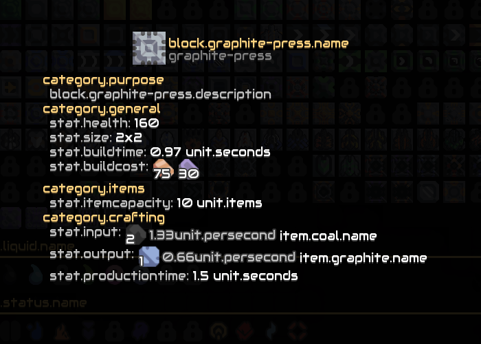

# scrap

Scrap is a Mindustry mod that sets all bundle values to their keys. It is useful when scraping data using [Pulverizer](https://github.com/mindustry-space/Pulverizer).

## Installation

Scrap can be installed using the game's built-in mod browser.

You can also install it manually by [downloading this repository](https://github.com/mindustry-space/scrap/archive/refs/heads/main.zip) and saving it to your mods folder.

```sh
curl -L https://github.com/mindustry-space/scrap/archive/refs/heads/main.zip > ~/.local/share/Mindustry/mods/scrap.zip
```

## Usage

With the mod installed, all localised strings for all languages will be set to their bundle keys. For example, you'll notice that the database now looks something like this:



## License

[GPL-3.0](LICENSE)
